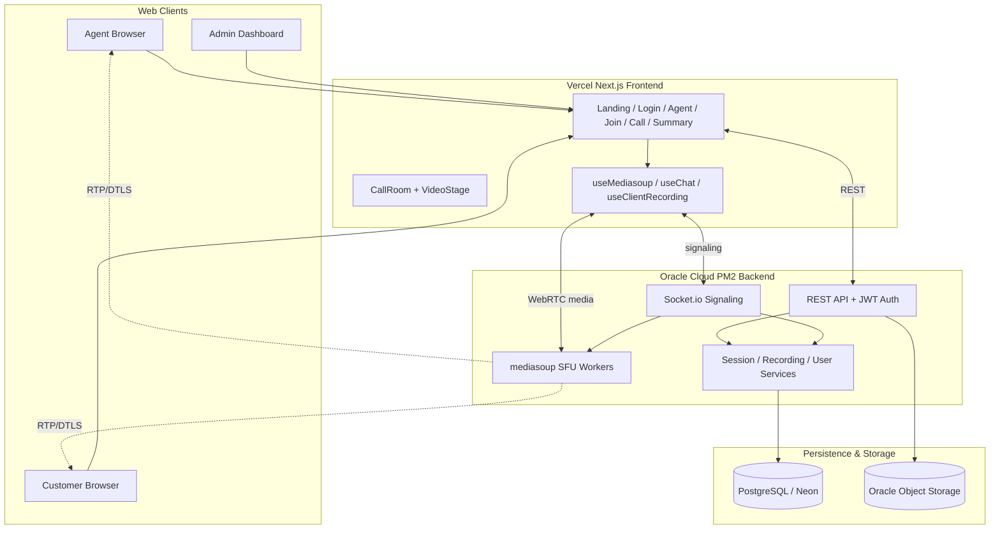
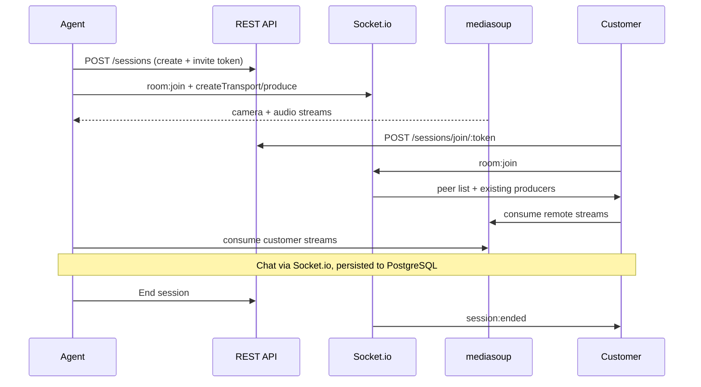

# AssistSphere — Architecture

Real-time video support platform built for the AtomQuest Hackathon finale. All media routes through a self-hosted **mediasoup SFU** — no third-party video SDKs.

## System Diagram



## Call Flow



## Video Layout (VideoStage)

| Participants | Layout |
|---|---|
| 1 | Full-width centered tile |
| 2 | 50% / 50% side by side |
| 3 | Local user 50% left; two remotes stacked 25% each on right |
| 4 | 2×2 grid (25% each) |
| Screen share active | 75% presentation stage left; 25% camera filmstrip right |

Screen share uses a **separate mediasoup producer** (`appData.source: screen`). Camera tiles never show the presentation feed. React state management forces component re-renders by recreating `MediaStream` instances whenever remote tracks are added or removed to ensure flawless UI synchronization.

## Tech Stack

| Layer | Technology |
|---|---|
| Frontend | Next.js 15, React, Tailwind CSS |
| Backend | Express 5, Socket.io, PM2 |
| Media | mediasoup SFU (Oracle Cloud Server) |
| Database | PostgreSQL via Prisma (Neon) |
| Auth | JWT (users, agents, session tokens) |
| Metrics | Prometheus (`/metrics`) |

## Requirements Checklist

### Must-Have (Section 2)

| Requirement | Status | Implementation |
|---|---|---|
| Agent creates session + invite link | ✅ | `POST /sessions`, `/agent` portal |
| Browser join, no app install | ✅ | WebRTC + Next.js |
| Track who is in session | ✅ | `Participant` model + mediasoup peers + People panel |
| End session, clean disconnect | ✅ | `session:end`, transport teardown, `session:ended` |
| Session history persisted | ✅ | Prisma + `/summary/[sessionId]` |
| Real-time A/V both ways | ✅ | mediasoup SFU produce/consume |
| Media via server (not P2P) | ✅ | mediasoup router, no peer mesh |
| Mute / video off | ✅ | Producer pause + UI toggles |
| In-call chat real-time | ✅ | Socket.io `chat:message` |
| Chat persisted | ✅ | `Message` model + API |
| Agent vs Customer roles | ✅ | JWT `Role`, route guards |
| Invite required for customers | ✅ | `inviteToken` on join |

### Good-to-Have (Section 3)

| Feature | Status | Notes |
|---|---|---|
| Call recording | ✅ | Agent-side MediaRecorder composite + upload |
| File sharing in chat | ✅ | Multer upload, images/PDF/docs |
| Reconnect grace window | ✅ | `reconnect.service.ts`, 30s grace |
| Admin dashboard | ✅ | `/admin` live + history + force end |
| Observability | ✅ | Prometheus gauges at `/metrics` |

### Additional Features Built

- User accounts (register/login) with Agent or Customer role
- Dynamic Zoom/Meet-style video layouts + maximize tile
- Separate presentation stage (75/25 split)
- Screen share, raise hand, emoji stickers
- Post-call summary page with transcript + recording download
- Dark/Light theme professional UI utilizing native CSS variables
- Robust session persistence with PM2 ensuring zero-downtime server restarts
- Smart Remote Pointer ("Look Here") for real-time visual alignment during screen shares
- Live Canvas Annotations & drawings over shared screens
- Secure, server-side OCI Object Storage file uploads and media delivery

## Security Notes

- JWT on all session APIs and socket handshake
- Customers cannot create/end sessions or record
- File upload type whitelist + size limits
- Rate limiting on API (`100 req/min`)
- Session access checks on messages/recordings
- AES-256-GCM on-the-fly encryption and decryption pipeline for all stored call recordings

## Environment

```env
# backend/.env
DATABASE_URL=postgresql://...
JWT_SECRET=...
# No agent secret needed; JWT/auth manages agent sessions
MEDIASOUP_ANNOUNCED_IP=xxx.xxx.xxx.xxx  # Oracle Cloud Public IP
ADMIN_USERNAME=admin
ADMIN_PASSWORD=admin123
```

## Known Limitations

- Recording is client-side composite (agent browser), not server-side FFmpeg

## Demo Credentials

| Role | Access |
|---|---|
| Agent (account) | Register at `/register` as Agent |
| Agent (guest) | Name on `/agent` creates an ad-hoc session token |
| Admin | `admin` / `admin123` |
| Customer | Join via invite link (login optional) |
